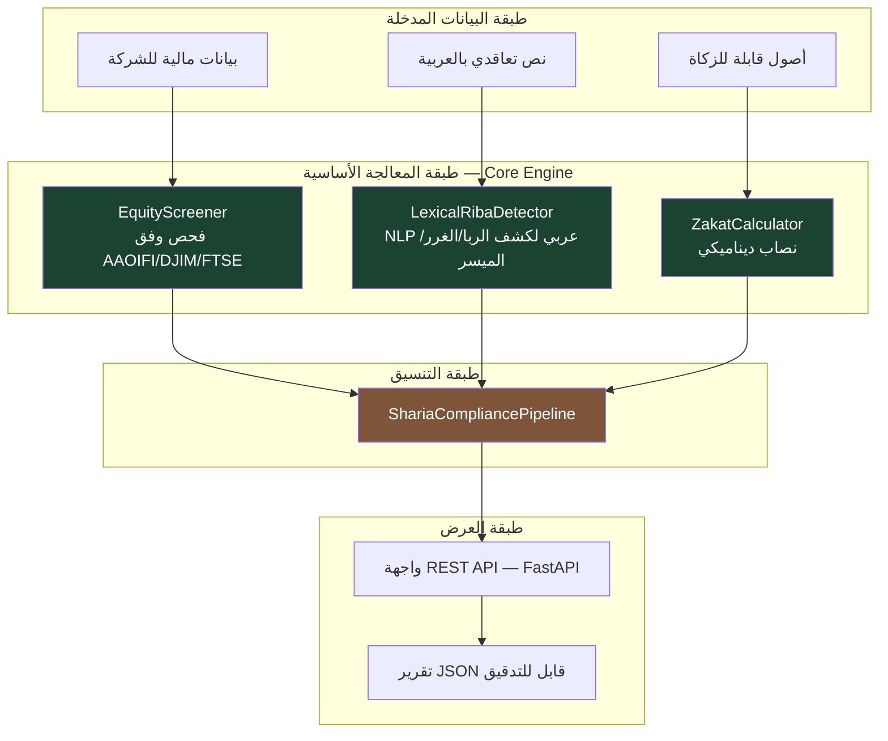
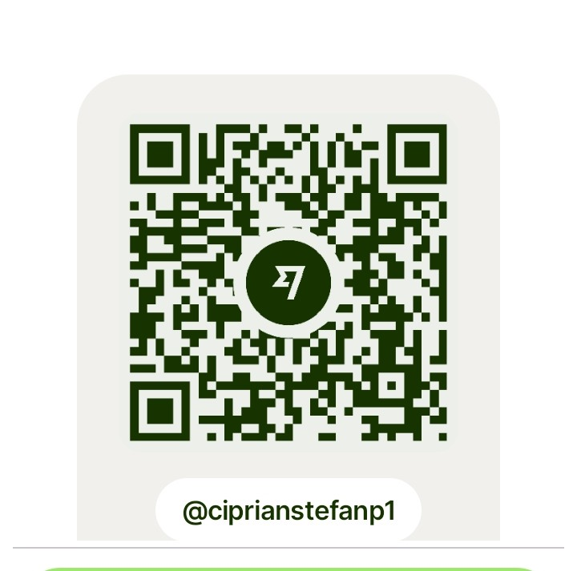

<div align="center">


# Sharia-AI

### مجموعة أدوات مفتوحة المصدر للبيانات والذكاء الاصطناعي من أجل الامتثال الشرعي في القطاع المالي التقني (Fintech)

[](./LICENSE)
[](https://www.python.org/)
[](#)
[](#)
[](#)

**المؤلف: Ciprian Ștefan Pleșca**

</div>

---

## نبذة عامة

**Sharia-AI** منصة مفتوحة المصدر، بُنيت لمعالجة مشكلة تقنية حقيقية وليست افتراضية: غياب أدوات **مفتوحة، قابلة للتدقيق، وقابلة للتفسير** للتحقق من الامتثال الشرعي للشركات والعقود والأصول المالية — خصوصًا في أسواق منطقة الشرق الأوسط وشمال أفريقيا (MENA).

يدمج المشروع ثلاث وحدات مستقلة قابلة للتشغيل البيني: فحص الأسهم، تحليل العقود بالعربية عبر معالجة اللغة الطبيعية (NLP)، وحساب الزكاة — مُنسَّقة عبر خط أنابيب واحد قادر على إنتاج تقارير امتثال منظَّمة، قابلة للتصدير، وقابلة للتحقق سطرًا بسطر.

معظم الحلول القائمة لفحص الامتثال الشرعي («Sharia Screening») هي إما خدمات مملوكة مغلقة المصدر (صناديق سوداء بلا شفافية منهجية)، أو أدوات مصمَّمة حصرًا للأسواق الغربية دون دعم أصلي للغة العربية أو لمعايير هيئة المحاسبة والمراجعة للمؤسسات المالية الإسلامية (AAOIFI). يسعى Sharia-AI إلى معالجة هذه الفجوة عبر بنية معمارية معيارية، موثّقة بالكامل وقابلة للمراجعة من قِبل أي هيئة رقابة شرعية أو فريق تدقيق.

> **تنويه منهجي مهم:** هذه الحزمة البرمجية هي أداة تقنية **للفرز الأولي والمساعدة في اتخاذ القرار** فحسب. إنها **لا** تصدر فتوى، و**لا** تُغني عن رأي هيئة رقابة شرعية معتمدة (Sharia Supervisory Board). يجب أن يخضع أي استخدام مؤسسي لهذه الأدوات لتحقّق فقهاء وقانونيين مؤهَّلين.

---

## لماذا وُجد هذا المشروع

تواجه الشركات في العالم العربي — وخصوصًا الشركات الصغيرة والمتوسطة والفينتك الناشئة — ثلاث فجوات تقنية متزامنة غالبًا:

| الفجوة | الأثر العملي |
|---|---|
| **غياب أدوات تقنية لفحص الامتثال الشرعي آليًا** | يتم التحقق من الامتثال يدويًا، بتكلفة عالية، ببطء، وبتباين كبير بين الشركات. |
| **ضعف تغطية معالجة اللغة العربية في أدوات Fintech العامة** | العقود المُحرَّرة بالعربية لا يمكن تحليلها آليًا بالحلول الغربية (الكتابة من اليمين لليسار، الصرف، اللواصق الحرفية). |
| **منهجيات امتثال غير شفافة** | لا تستطيع الشركات معرفة *لماذا* صُنِّفت أداة مالية معينة كمتوافقة أو غير متوافقة. |

يعالج Sharia-AI هذه الفجوات الثلاث معًا عبر: (1) وحدات بايثون مفتوحة المصدر بالكامل، (2) محرك معالجة لغة طبيعية عربي مبني من الصفر لهذا المجال بالتحديد، و(3) تقارير قابلة للتفسير، قاعدة بقاعدة، وقابلة للتصدير بصيغة JSON لأغراض التدقيق.

---

## البنية المعمارية للنظام



التوثيق الكامل للبنية المعمارية، بما في ذلك مخططات التسلسل الزمني وتدفّقات كل وحدة على حدة، متاح في [موسوعة المشروع (Wiki)](../../wiki) وفي [`docs/architecture.md`](./docs/architecture.md).

---

## هيكل المستودع

```
sharia-fintech-ai/
├── src/sharia_ai/
│   ├── screening/         # فحص الأسهم (AAOIFI / DJIM / FTSE Shariah)
│   │   ├── equity_screener.py
│   │   └── rules.py
│   ├── nlp/                # محرك NLP عربي لكشف الربا/الغرر/الميسر
│   │   ├── arabic_preprocessing.py
│   │   └── riba_detector.py
│   ├── zakat/               # حاسبة الزكاة (نصاب ديناميكي، أصول/خصوم)
│   │   └── zakat_calculator.py
│   ├── pipelines/           # تنسيق شامل -> تقرير موحَّد
│   │   └── compliance_pipeline.py
│   ├── api/                 # واجهة REST (FastAPI)
│   │   └── main.py
│   └── utils/config.py
├── tests/                   # 16 اختبارًا وحدويًا (unittest، مكتبة قياسية، بلا اتصال بالكامل)
├── data/
│   ├── sample/               # عقود وأسهم نموذجية
│   └── rules/                # حدود AAOIFI بصيغة YAML (مرجع خارجي)
├── examples/demo_screening.py
├── docs/                     # بنية معمارية، منهجية، مرجع API، خارطة طريق
├── assets/                   # ملفات مرئية (شعار، موارد المشروع)
├── WHITEPAPER.md
├── pyproject.toml / requirements.txt
└── .github/workflows/ci.yml
```

---

## التثبيت

```bash
git clone https://github.com/Ciprian-LocalPulse/sharia-fintech-ai.git
cd sharia-fintech-ai
python3 -m venv .venv && source .venv/bin/activate
pip install -e ".[dev]"
```

### تشغيل الاختبارات

```bash
pytest --cov=sharia_ai --cov-report=term-missing
```

### تجربة سريعة (شاملة، دون خادم)

```bash
PYTHONPATH=src python3 examples/demo_screening.py
```

### تشغيل الواجهة البرمجية محليًا

```bash
uvicorn sharia_ai.api.main:app --reload
# توثيق تفاعلي: http://localhost:8000/docs
```

---

## أمثلة استخدام برمجية

**فحص الامتثال الشرعي لشركة:**

```python
from sharia_ai.screening.equity_screener import CompanyFinancials, EquityScreener

company = CompanyFinancials(
    name="Al-Noor Retail Group",
    sector="retail",
    market_cap=50_000_000,
    interest_bearing_debt=12_000_000,
    cash_and_interest_bearing_deposits=8_000_000,
    accounts_receivable=15_000_000,
    total_revenue=40_000_000,
    haram_revenue=500_000,
)

result = EquityScreener().screen(company)
print(result.summary())
```

**كشف الربا في نص عربي:**

```python
from sharia_ai.nlp.riba_detector import LexicalRibaDetector

detector = LexicalRibaDetector()
report = detector.analyze("يُسدد القرض بفائدة سنوية قدرها خمسة بالمئة.")
print(report.summary())
```

اطّلع أيضًا على [`examples/demo_screening.py`](./examples/demo_screening.py) لمشاهدة تدفّق كامل (فحص أسهم + تحليل عقود + حساب زكاة، مجمَّعة في تقرير JSON قابل للتصدير).

---

## الأساس المنهجي

الحدود المُطبَّقة في محرك الفحص المالي ([`screening/rules.py`](./src/sharia_ai/screening/rules.py)) متوافقة — من حيث الترتيب العام والمنطق، وليس نقلاً حرفيًا — مع المنهجيات العامة لمؤشري **Dow Jones Islamic Market (DJIM)** و**FTSE Shariah Global Equity Index Series**، وكذلك مع **معيار AAOIFI الشرعي رقم 21**.

جميع الحدود **قابلة للتهيئة** — وليست مُقوننة كنص فقهي ثابت، بل كنقطة انطلاق قابلة للتعديل من قِبل أي هيئة رقابة شرعية تتبنّى الأداة. التفاصيل الكاملة، بما فيها حدود كل منهجية، مناقَشة في [`WHITEPAPER.md`](./WHITEPAPER.md) و[`docs/compliance_methodology.md`](./docs/compliance_methodology.md).

من الأمانة العلمية التأكيد أن القيم الرقمية المُعتمدة (33% للاستدانة، 33% للسيولة الربوية، 49% للذمم المدينة، 5% للإيراد المحرَّم) هي **قيم إرشادية شائعة**، وليست نصوصًا فقهية مُجمَعًا عليها — إذ تتفاوت بين هيئات الرقابة الشرعية، وبين منهجيات المؤشرات، وعبر الزمن مع المراجعات الدورية لها.

التوثيق الأكاديمي الموسَّع، بمخططات Mermaid وعرض رسمي لكل وحدة (البنية المعمارية، منهجية الفحص، محرك NLP العربي، حاسبة الزكاة، خط أنابيب التنسيق، مرجع API)، متاح بالكامل في [موسوعة المشروع (Wiki)](../../wiki).

---

## خارطة الطريق

راجع [`docs/roadmap.md`](./docs/roadmap.md) للخطة التفصيلية. باختصار:

- [x] فحص الأسهم القائم على قواعد (AAOIFI/DJIM)
- [x] كاشف الربا/الغرر/الميسر المعجمي للعربية (بلا اتصال، حتمي)
- [x] حاسبة الزكاة بنصاب ديناميكي
- [x] خط أنابيب التنسيق + واجهة REST
- [ ] دمج نموذج محوّل (AraBERT مُعاد ضبطه) للتقييم الدلالي
- [ ] دعم التكافل (التأمين الإسلامي) والصكوك (السندات الإسلامية)
- [ ] لوحة تحكّم ويب لتصوّر تقارير الامتثال
- [ ] موصِّلات لمصادر بيانات مالية حيّة (أسواق MENA)

---

## كيفية المساهمة

المساهمات مرحَّب بها — من تصحيح/توسيع المعجم العربي، إلى إضافة معايير فحص أو تكاملات جديدة. راجع [`docs/contributing.md`](./docs/contributing.md) للدليل الكامل و[`CODE_OF_CONDUCT.md`](./CODE_OF_CONDUCT.md) لقواعد المجتمع.

---

## الاستشهاد الأكاديمي

عند استخدام هذه الأداة في بحث أكاديمي، يُرجى الاستشهاد بها وفق [`CITATION.cff`](./CITATION.cff):

> Pleșca, C. Ș. (2026). *Sharia-AI: An Open, Auditable Toolkit for Sharia-Compliant Fintech Screening in the Arab World*. Working paper. Repository: sharia-fintech-ai. License: MIT.

---

## الترخيص

هذا المشروع موزَّع تحت رخصة **MIT** — راجع [`LICENSE`](./LICENSE).

---

## ادعم المشروع

يبقى Sharia-AI **منفعة عامة مجانية**، موزَّعًا تحت رخصة MIT، دون أي تكلفة وصول أو اشتراك. إذا استفدت من هذا المشروع وتودّ دعم تطويره المستمر، يمكنك التبرّع عبر:

<div align="center">

</div>

---

<div align="center">

**المؤلف: Ciprian Ștefan Pleșca**

*يُعدّ Sharia-AI جزءًا من سلسلة مشاريع مفتوحة المصدر مُكرَّسة للمنفعة العامة، في مجالات مثل التشفير والتقنية المدنية والبنية التحتية الطبية والعلمية.*

</div>
